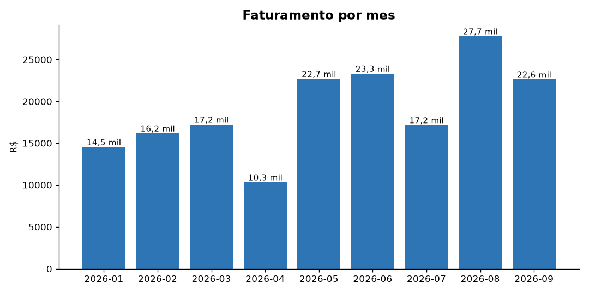

# Automatic Sales Report from Excel

Turn a raw sales spreadsheet into a clean, formatted report in **one command**: totals by month, product and salesperson, plus a chart — ready to send.



## What it does

1. Reads a sales spreadsheet (`.xlsx`).
2. Checks the data: missing columns are reported clearly, and invalid rows are skipped with a warning.
3. Calculates key numbers: total revenue, number of sales, average ticket, best product and best salesperson.
4. Creates a monthly revenue chart.
5. Saves a formatted Excel report with 4 tabs: **Resumo** (summary, with chart), **Por mes** (by month), **Por produto** (by product) and **Por vendedor** (by salesperson). Labels can be in English or Portuguese.

What used to take an hour of copy-paste every month now takes a few seconds.

## How to use

```bash
pip install pandas openpyxl matplotlib
python gerar_dados_exemplo.py          # creates sample data (fake, for demo only)
python relatorio.py vendas_exemplo.xlsx
```

Output goes to the `saida/` folder: `relatorio_vendas.xlsx` and `grafico_mensal.png`.

The input spreadsheet needs these columns: `Data`, `Vendedor`, `Produto`, `Quantidade`, `Preco Unitario` (date, salesperson, product, quantity, unit price). Column names can be adapted to your own spreadsheet.

## Tech

Python · pandas · openpyxl · matplotlib

---

## 🇧🇷 Resumo em português

Transforma uma planilha de vendas em um relatório formatado com um comando: totais por mês, produto e vendedor, mais um gráfico. Os dados de exemplo são inventados (gerados por `gerar_dados_exemplo.py`).
