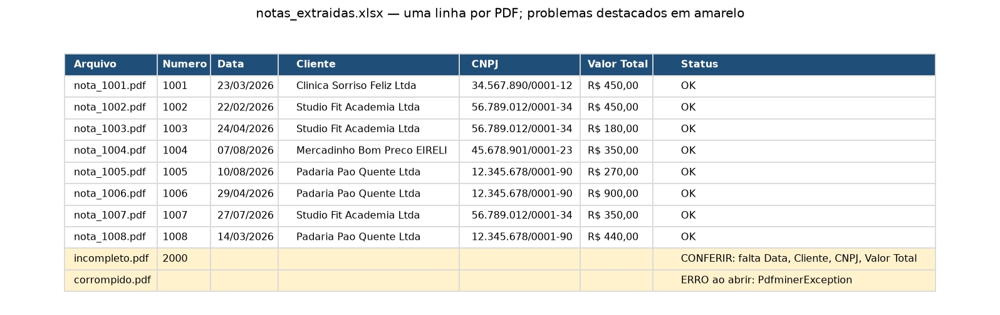

# PDF Invoice Data Extractor

Stop typing invoice data by hand. Drop your PDFs in a folder, run **one command**, and get a clean Excel spreadsheet with one row per document.

Runs 100% on your computer: no files are uploaded anywhere.

## What it does

1. Opens every PDF in a folder.
2. Finds the fields: invoice number, date, client, tax ID (CNPJ) and total amount.
3. Builds an Excel sheet with all documents, values formatted as currency.
4. **Flags problems instead of hiding them**: if a field is missing or a PDF can't be opened, the row is highlighted in yellow with the reason (e.g. `CONFERIR: falta Data` = "CHECK: date missing").

## Example output



## How to use

```bash
pip install pdfplumber pandas openpyxl fpdf2
python gerar_pdfs_exemplo.py      # creates 12 sample PDFs (fake data)
python extrator.py pdfs_exemplo
```

Result: `saida/notas_extraidas.xlsx`

## Adapting to your documents

Each field is found by a search pattern in the `CAMPOS` list at the top of `extrator.py`. To read a different document layout (receipts, purchase orders, resumes), only those patterns change.

## Tech

Python · pdfplumber · regular expressions · pandas · openpyxl

---

## 🇧🇷 Resumo em português

Lê uma pasta de PDFs (notas, recibos) e monta uma planilha Excel com os dados, destacando em amarelo o que precisa de conferência. Roda só no computador, sem enviar arquivos para a internet. Os PDFs de exemplo são inventados.
