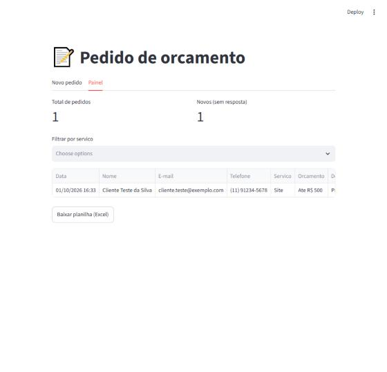
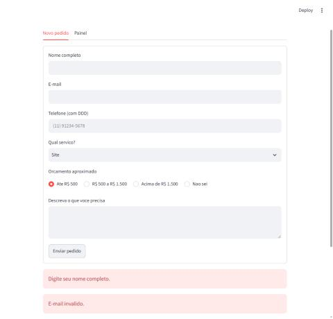

# Quote Request Form → Excel

A simple web form where customers request a quote. Every request is checked and saved to an Excel spreadsheet, and a dashboard shows all requests with filters and a download button.

No more lost WhatsApp messages or copy-pasting into a spreadsheet.



## What it does

- **Form**: name, email, phone, service, budget and description.
- **Validation**: wrong email, phone without area code or empty description show a clear message, and what the customer typed is **kept** so they only fix the mistake.
- **Saves to Excel**: one row per request, with date and time.
- **Dashboard**: total requests, new requests, filter by service and download as Excel.



## How to use

```bash
pip install streamlit pandas openpyxl
streamlit run app.py
```

Opens in the browser at `http://localhost:8501`. Requests are saved to `dados/pedidos.xlsx`.

## Can be extended to

Google Sheets instead of a local file, email/WhatsApp notification on each new request, or a password-protected dashboard.

## Tech

Python · Streamlit · pandas · openpyxl

---

## 🇧🇷 Resumo em português

Formulário web de pedido de orçamento que confere os dados e salva tudo numa planilha Excel, com painel para ver, filtrar e baixar os pedidos. Os dados das imagens são de teste.
