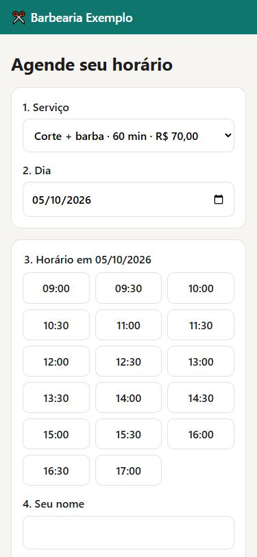
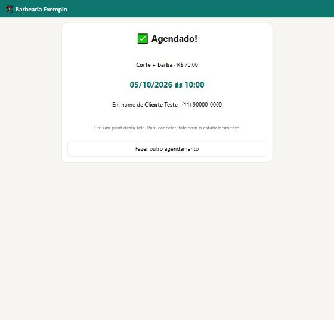
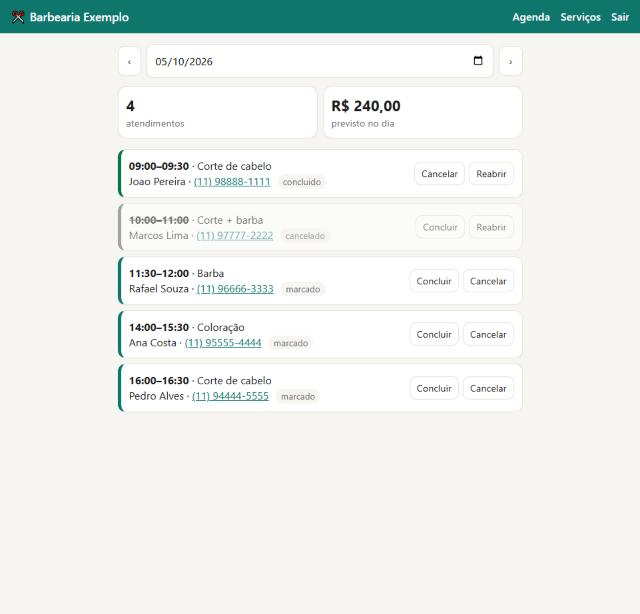

# Agenda Fácil — Online Booking Web App

A complete booking app for barbershops, salons and clinics. Customers book online from their phone; the owner manages the day in a private dashboard. No more booking by WhatsApp messages or paper.

| Customer books (mobile) | Confirmation | Owner dashboard |
|---|---|---|
|  |  |  |

## Features

**For customers**
- Pick a service, a day and a free time slot — only truly available times are shown.
- Mobile-first design with large, easy-to-tap time buttons.
- Confirmation page with a private link.

**For the owner** (password protected)
- Daily agenda with number of appointments and expected revenue.
- Mark appointments as done or cancelled (cancelling frees the slot again).
- One-tap WhatsApp link to each customer.
- Add services (name, duration, price) and turn them on/off.

**Business rules**
- Opening hours (9:00–18:00), closed on Sundays, 30-minute grid — all configurable in `horarios.py`.
- A service never ends after closing time, past times are hidden, and overlapping bookings are impossible.

## Security & reliability

- **No double booking**: the slot is checked again on the server inside a locked database transaction, so two people clicking the same time at the same second can't both get it.
- **CSRF protection** on every form.
- **Private confirmation links** use random codes (not 1, 2, 3…), so nobody can see other customers' data by changing the URL.
- Admin password and secret key live in a `.env` file that never goes to GitHub.
- **15 automated tests** (`pytest`) cover time-slot rules, booking, double booking, login and admin actions.

## How to run

```bash
pip install flask python-dotenv pytest
cp .env.example .env              # then set your own password and secret key
flask --app app init-db           # creates the database with sample services
flask --app app run               # open http://127.0.0.1:5000
python -m pytest -v               # run the tests
```

## Tech

Python · Flask · SQLite · Jinja templates · plain CSS (no framework) · pytest

## Possible extensions

WhatsApp/email reminders, multiple professionals with separate agendas, online payment for a deposit, and deploying to a cloud server with a custom domain.

---

## 🇧🇷 Resumo em português

App web completo de agendamento: o cliente marca pelo celular escolhendo serviço, dia e horário livre; o dono tem um painel com senha para ver a agenda do dia, concluir ou cancelar atendimentos e cadastrar serviços. Tem proteção contra agendamento duplo, CSRF, links de comprovante secretos e 15 testes automáticos. Os nomes e telefones nas imagens são inventados.
