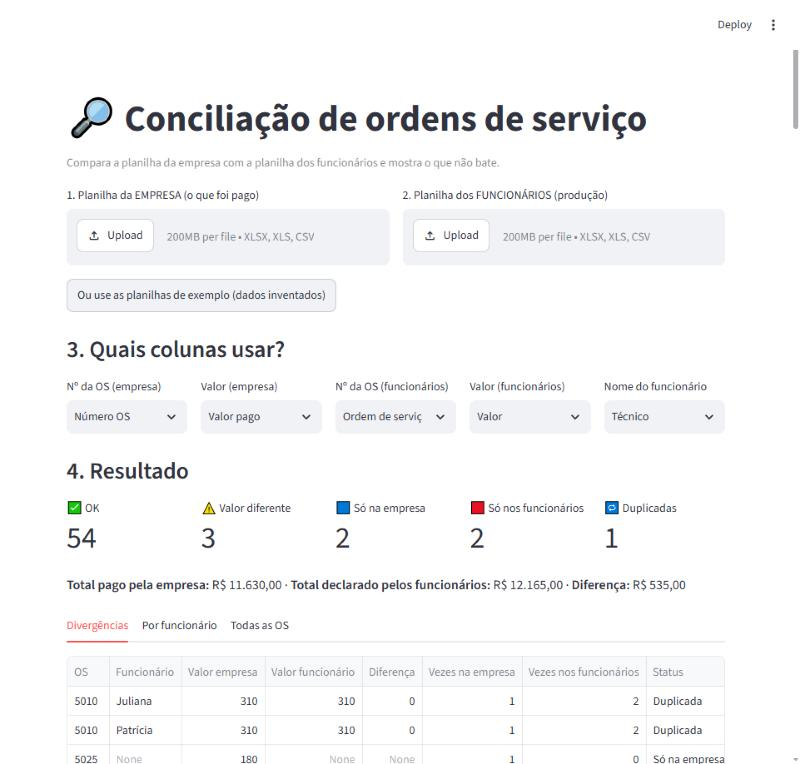

# Spreadsheet Reconciliation — Service Orders

Compares two spreadsheets that should match — what the **company paid** vs what **employees reported** — and shows exactly what doesn't add up. Upload both files, pick the columns, get the answer and an Excel report.



## What it finds

| Status | Meaning |
|---|---|
| ✅ OK | In both spreadsheets with the same amount |
| ⚠️ Valor diferente | In both, but amounts differ |
| 🟦 Só na empresa | Company paid, nobody reported it |
| 🟥 Só nos funcionários | Employee reported it, company didn't pay |
| 🔁 Duplicada | Same order appears twice (e.g. claimed by two employees) |

Plus a **per-employee summary**: orders declared vs confirmed, amount declared vs confirmed, and the difference.

## Built for real-world messy data
- Order numbers in different formats match: `OS-00123`, `os 123`, `123`, `123.0` (Excel), `O.S. 0123`.
- Amounts like `R$ 1.234,50` or `1234.5` are understood.
- **Column names are chosen in the app** (with automatic suggestions), so it works with each company's spreadsheet layout.
- Rows without an order number are ignored; 1-cent rounding differences are tolerated.

## How to run
```bash
pip install streamlit pandas openpyxl pytest
python gerar_exemplo.py      # creates two fake spreadsheets with planted mismatches
streamlit run app.py         # or click "use sample spreadsheets" in the app
python -m pytest -v          # 8 automated tests
```

## Tech
Python · pandas · Streamlit · openpyxl · pytest

The same approach works for any "do these two lists match?" problem: bank statement vs. accounting, stock count vs. system, orders vs. invoices.

---

## 🇧🇷 Resumo em português
Compara a planilha da empresa (o que foi pago) com a dos funcionários (o que foi feito) e mostra valor diferente, OS que só está de um lado e OS duplicada, com resumo por funcionário e relatório em Excel. Aceita formatos bagunçados de número de OS e de valor. Dados de exemplo inventados.
