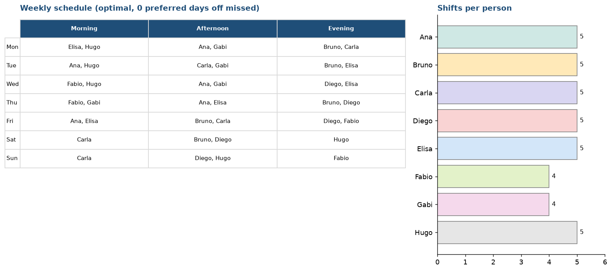

# Shift Scheduler — fair weekly staff schedules

Builds a weekly schedule for shops, clinics, restaurants or call centres. You say who is needed on each shift and who can work when; the solver returns a schedule that follows every rule and spreads the work evenly, or tells you exactly why it can't.

**[Watch the demo video](video/shift-scheduler-demo-web.mp4)**: recorded against the real shift scheduler, not a mock-up. Re-record it with `python make_video.py` (needs `pip install -r ../requirements-video.txt` and `playwright install chromium`).



## What it does

- **Hard rules, never broken:** every shift gets exactly the headcount it needs, nobody works a shift they marked unavailable, one shift per person per day, no closing shift followed by an opening shift the next morning, weekly shift limit per person.
- **Soft goals, optimised:** honour preferred days off first, then keep the gap between the busiest and the lightest person as small as possible.
- **Honest failures:** if the week is impossible (for example not enough people for Saturday evening, or not enough total capacity) it says which shift or limit is the problem instead of returning a wrong schedule.
- **Web app** (Streamlit) to edit coverage, availability and preferences, rebuild, and download the schedule as CSV.

## Why a solver and not a loop

Rules like these interact: fixing Monday can break Thursday. The schedule is modelled as a constraint problem and solved with Google OR-Tools (CP-SAT), which either finds an optimal answer or proves there isn't one. The sample week (8 people, 38 shifts) solves in about one second.

## How to run

```bash
pip install ortools streamlit pandas pytest
streamlit run app.py        # the web app
python escala.py            # prints the sample schedule in the terminal
python -m pytest            # 13 tests
```

## Tests

13 automated tests. The schedule tests re-check the finished schedule against each rule directly (they don't trust the solver's own variables), and I confirmed they fail when a rule is removed from the model. Two more tests drive the real web app headlessly: it builds the sample schedule, and it shows a clear error for an impossible week.

## What is sample data

The team, availability and coverage in `escala.py` (`exemplo()`) are invented. For a real client the same model takes their staff list, availability and coverage rules; common extras (skills per shift, minimum days off in a row, fixed assignments, overtime cost) are additional constraints on the same model.
